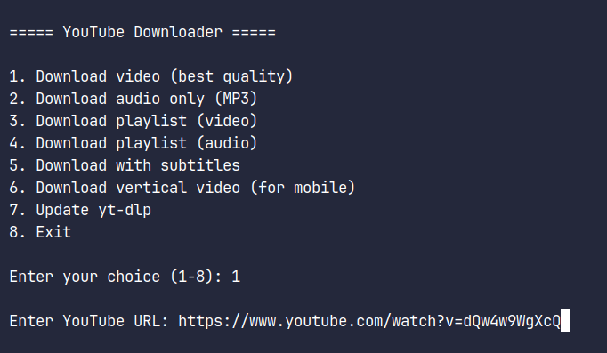

# yt-dlp-helper

[](#)
[](#)
[](#)

A feature-rich script for downloading videos and audio from YouTube using yt-dlp.

## Features

- Download videos in best quality
- Extract audio (MP3 format)
- Download entire playlists (video or audio)
- Download videos with subtitles
- Optimized vertical video download
- Built-in yt-dlp updater
- Flexible download location options:
  - Downloads folder
  - Videos folder
  - Music folder
  - Custom path

## Preview




## Prerequisites

```bash
sudo apt install yt-dlp
```

## Installation

1. Download the script:

```bash
wget https://raw.githubusercontent.com/merkksgit/yt-dlp-helper/main/yt-dlp-helper.sh
```

2. Make it executable:

```bash
chmod +x yt-dlp-helper.sh
```

3. Run the script:

```bash
./yt-dlp-helper.sh
```
